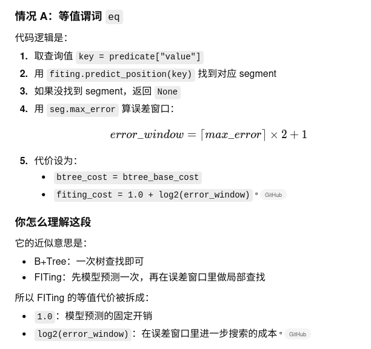
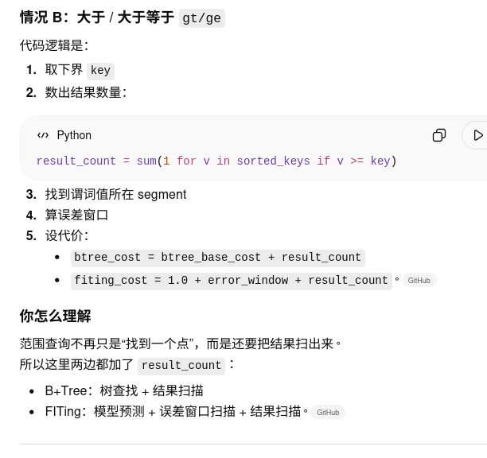
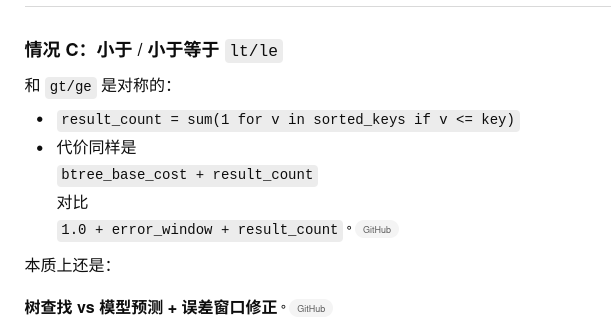
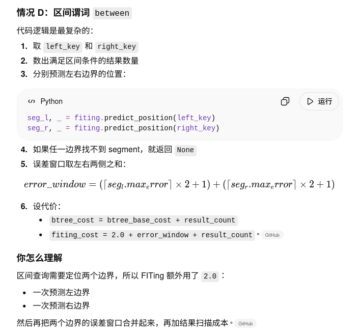
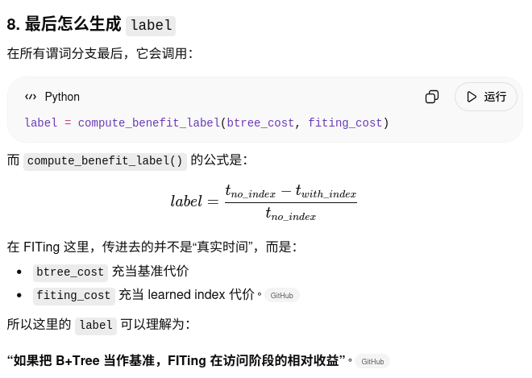

# model/dataset_builder.py
为每个 query-index 组合生成一行样本，里面包含：
查询特征 索引特征 查询-索引交互特征 该索引的收益标签 label。
给后面的模型训练准备监督学习样本。

它处在 run_pipeline.py 的第一步。
整个流水线是：
build_dataset() 先构造训练集
train_model() 用训练集训练 MLP
predict_benefit() 对测试负载预测收益
greedy_select() 选出最终索引集合。

5类函数：先准备候选，再测标签，再拼特征，最后写 CSV
第一类是辅助统计与解析函数：
fetch_column_values()
extract_tables()
get_table_columns()
candidate_matches_table()
filter_relevant_candidates()

第二类是索引创建/删除与执行计时：
create_index()
drop_index()
timed_query()

第三类是收益标签计算函数：
compute_benefit_label()
compute_fiting_label()

第四类是主函数：
build_dataset()

第五类是候选优先级排序函数：
candidate_priority()

## build_dataset
先生成全局候选索引
对每条查询筛出 relevant_candidates
再按 candidate_priority() 排序
只取前 max_candidates_per_query 个
然后才去做真实执行或 FITing 近似评估

## compute_fiting_label
近似代价评估

## candidate_priority
在给定一条查询之后，先从“所有相关候选索引”里挑出更值得优先评估的那些候选。